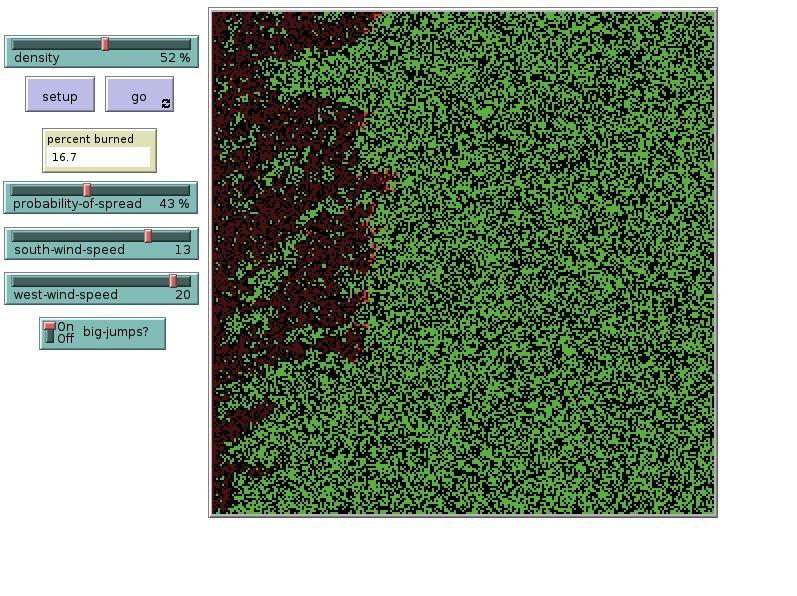
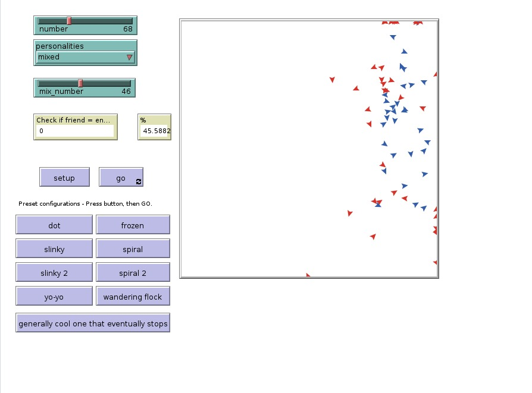
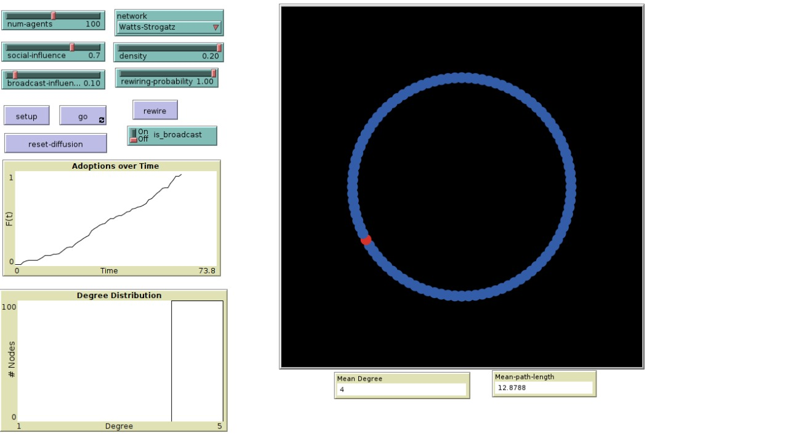
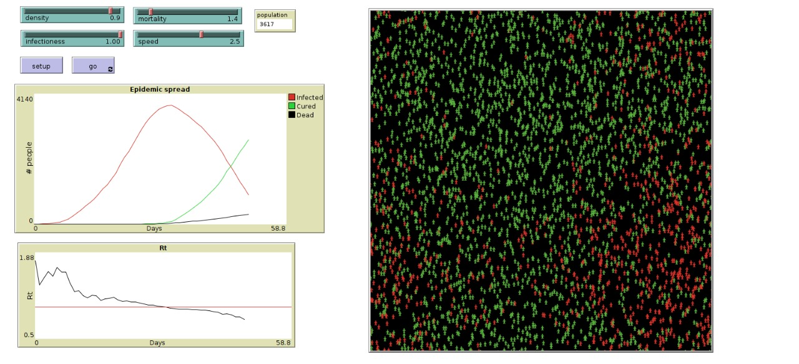
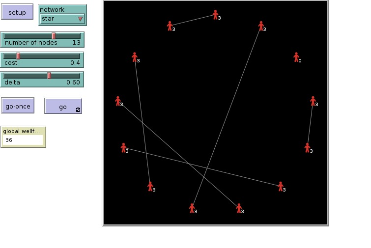

# Agent-Based-Simulations ⭐

A repository containing introductory to advanced assignments and their solutions for netlogo ABM models. 

## Directory Architecture: 📁
#
```
Agent-Based-Simulations
├─ Fire_model_extension.nlogo
├─ Information_Diffusion_Model.nlogo
├─ M1.nlogo
├─ M2.nlogo
├─ M3.nlogo
├─ M4.nlogo
├─ README.md
├─ epidemic.nlogo
├─ heros_cowards_model.nlogo
├─ images
│  ├─ 3.jpeg
│  ├─ img1.jpeg
│  ├─ img2.jpeg
│  ├─ img4.jpeg
│  └─ img5.jpeg
└─ social_ecomoic_networks_model.nlogo

```
## Fire-model_extension 🔥



## Hero-Coward-Model 🔥



## Information-Diffusion-Model 🔥



## Pandemic-Model 🔥



## Social_Ecomoic_Networks_Model 🔥



## Model and Instructions to run :runner:
- Each model has documentation in ODD protocol, which can be found in the info tab of the model. 
- This model has been created in netlogo version 6.2. Kindly download netlogo 6.2 and use it to run the model 


